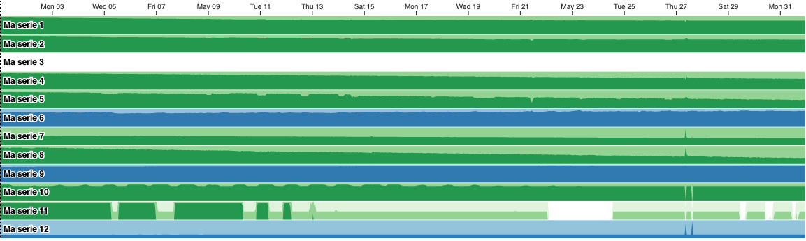

# d3-horizon
Horizon graph for D3



## Installation

```bash
npm i @aquassay/d3-horizon
```

## Dependencies

- [D3 Array](https://github.com/d3/d3-array)
- [D3 Axis](https://github.com/d3/d3-axis)
- [D3 Scale](https://github.com/d3/d3-scale)
- [D3 Scale Chromatic](https://github.com/d3/d3-scale-chromatic)
- [D3 Selection](https://github.com/d3/d3-selection)
- [D3 Shape](https://github.com/d3/d3-shape)

## Usage

To show your data, You have to do this : 

```js
import { horizon } from '@aquassay/d3-horizon';

const container = document.getElementById('#my-horizon-container');
const data      = [/* your data here */];
const svg       = horizon(data);

container.innerHTML = '';
container.appendChild(svg);
```

And, if you want to export them to SVG file, You have to do this : 

```js 
import { getURL } from '@aquassay/d3-horizon';

const link = document.createElement('a');
const url  = getURL(svg);

link.href       = url;
link.download   = 'export.svg';

link.click();
```

